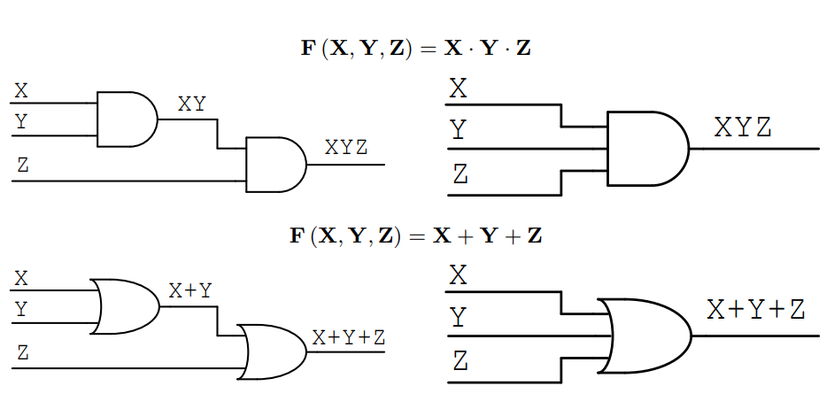

Sim, é possível utilizar uma imagem para representar as portas lógicas. Segue um exemplo em Markdown:

## Portas Lógicas

As portas lógicas são componentes básicos de circuitos digitais que realizam operações lógicas entre dois ou mais sinais de entrada. As portas lógicas mais comuns são:

  
  

### Porta AND

A porta AND realiza a operação lógica E entre duas ou mais entradas. Ela retorna 1 somente se todas as entradas forem 1.

  
A tabela verdade da porta AND é:

| A | B | Saída |
|---|---|-------|
| 0 | 0 |   0   |
| 0 | 1 |   0   |
| 1 | 0 |   0   |
| 1 | 1 |   1   |

### Porta OR

A porta OR realiza a operação lógica OU entre duas ou mais entradas. Ela retorna 1 se pelo menos uma das entradas for 1.

  
A tabela verdade da porta OR é:

| A | B | Saída |
|---|---|-------|
| 0 | 0 |   0   |
| 0 | 1 |   1   |
| 1 | 0 |   1   |
| 1 | 1 |   1   |

  
  
### Porta NAND

A porta NAND realiza a operação lógica E-NÃO entre duas ou mais entradas. Ela retorna 0 somente se todas as entradas forem 1.

  
A tabela verdade da porta NAND é:

| A | B | Saída |
|---|---|-------|
| 0 | 0 |   1   |
| 0 | 1 |   1   |
| 1 | 0 |   1   |
| 1 | 1 |   0   |
  

  

### Porta NOR

A porta NOR realiza a operação lógica OU-NÃO entre duas ou mais entradas. Ela retorna 1 somente se todas as entradas forem 0.

  
A tabela verdade da porta NOR é:

| A | B | Saída |
|---|---|-------|
| 0 | 0 |   1   |
| 0 | 1 |   0   |
| 1 | 0 |   0   |
| 1 | 1 |   0   |

  

  
  
### Porta XOR

Desculpe pelo erro! Segue abaixo o resumo completo sobre a porta lógica XOR:

## XOR (OU Exclusivo)

A porta lógica XOR (ou OR Exclusivo) retorna um sinal lógico verdadeiro (1) somente se as entradas forem diferentes entre si. Caso contrário, retorna um sinal lógico falso (0). 

  
### Tabela Verdade:

| Entrada A | Entrada B | Saída |
|-----------|-----------|-------|
|     0     |     0     |   0   |
|     0     |     1     |   1   |
|     1     |     0     |   1   |
|     1     |     1     |   0   |

______________________________________________________________________________________________________________________________________________________________

As portas lógicas em expressão booleana podem ser representadas por símbolos e operadores. Cada porta lógica tem sua própria representação em expressão booleana. Abaixo está uma tabela com as representações em expressão booleana para cada porta lógica:

| Porta Lógica | Representação em Expressão Booleana | Representação Matemática |
| --- | --- |---|
| AND | A ∧ B | A * B|
| OR | A ∨ B | A + B |
| NOT | ¬A | | A*(-1) |
| NAND | ¬(A ∧ B) ou A ↑ B | (A*B)*(-1) |
| NOR | ¬(A ∨ B) ou A ↓ B | (A+B)*(-1) |
| XOR | A ⊕ B |

  
  
Na tabela, "A" e "B" representam as entradas das portas lógicas e os símbolos ∧, ∨, ¬, ↑, ↓ e ⊕ representam, respectivamente, as operações de E (AND), OU (OR), NÃO (NOT), NAND, NOR e XOR.

Para criar uma expressão booleana para uma combinação de portas lógicas, basta combinar as expressões booleanas das portas lógicas individuais usando os operadores apropriados. Por exemplo, para uma expressão booleana que representa a combinação de duas portas lógicas AND e OR, pode-se usar a seguinte expressão:

(A ∧ B) ∨ (C ∧ D)

Essa expressão representa uma combinação de duas portas lógicas, uma AND entre A e B e outra AND entre C e D, seguida de uma OR das saídas dessas duas portas.

_________________________________________________________________________________________________________________________________________________________________

## Criando expressões que representam circuitos lógicos
  

  
  )

  
- Repare que as entradas da nossa função são X e Y, ou seja, temos uma F(X, Y);
- Para fazer montar uma expressão, precisamos ver que o resultado das duas portas AND entram em uma porta OR;
- A porta OR representa uma conta de +, onde se entrar (0 or 1) = 1; se entrar (1 or 1) = 1; 
- Já a porta AND, representa uma multiplicação, ou seja, qualquer sempre que tiver 0, multiplicará por 0 e o resultado será 0. Se as entrars forem 0 * 1 = 0, mas se forem 1 * 1 = 1; 
- Quando temos uma porta NOT (o triangulo), precisamos inverter o valor da entrada. O traço em cima do X ou Y, representam a porta NOT, que é a inversão do valor, ou seja, se entra 1, vira 0; Se entra 0, vira 1;
- Temos que fazer a seguinte operação F(X, Y) = ((Resultado da primeira AND) OR (Resultado da AND com números invertidos));
- OR é representado por "+" e AND por (*), assim como NOT é representado por um traço em cima, usarei aspa simples para representar o traço em cima (X', Y');
- Chegamos a operação da imagem, onde F(X, Y) = ((X * Y) + (X' * Y'));

### Mais exemplos de circuitos lógicos em expressões
  

  
  

